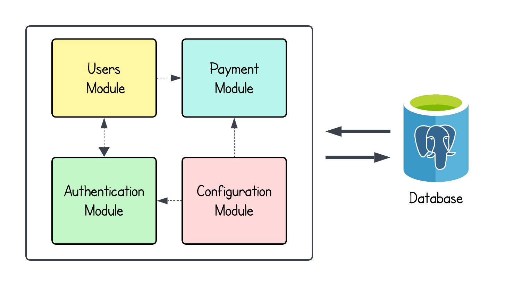
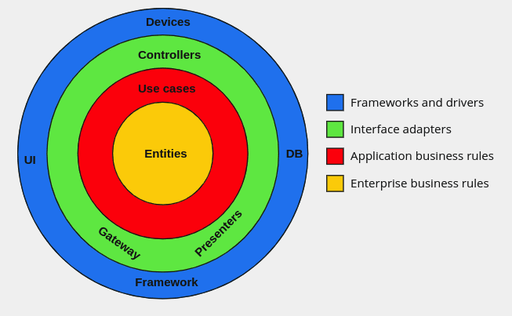

# NestJS Quickstarter


[](https://github.com/andrea-acampora/nestjs-ddd-quickstarter/actions/workflows/pages/pages-build-deployment)


[](https://github.com/semantic-release/semantic-release/tree/master)
[](https://conventionalcommits.org)


The purpose of this repository is to create a ready-to-use project following _Domain-Driven Design_, _Clean
Architecture_ and _Functional Programming_ best practices combined with some _DevOps_ techniques such as _Continuous
Integration_, _Continuous Delivery_ and _Quality Assurance_.

The project is completely open source using the **MIT** license, feel free to contribute by opening
a [issue](https://github.com/andrea-acampora/nestjs-ddd-quickstarter/issues/new/choose),
a [pull request](https://github.com/andrea-acampora/nestjs-ddd-quickstarter/compare) or
a [discussion topic](https://github.com/andrea-acampora/nestjs-ddd-quickstarter/discussions/new/choose).

In the following chapters you will find a description of the main choices, technologies and techniques adopted.

## Stack

[NodeJS](https://nodejs.org/en/) | [TypeScript](https://www.typescriptlang.org/) | [NestJS](https://nestjs.com/) | [PostgreSQL](https://www.postgresql.org/) | [Mikro-ORM](https://mikro-orm.io/) | [Docker](https://www.docker.com/)

[](https://nodejs.org/en)
[](https://www.typescriptlang.org)
[](https://nestjs.com)
[](https://www.postgresql.org)
[](https://mikro-orm.io)
[](https://www.docker.com)

## Instructions

1. Fork this repository and use it as ```template``` repository
2. Install all dependencies
     ```bash
     npm install
     ```
3. Start the _PostgreSQL_ development database in a local container
    ```bash
     docker-compose up -d
     ```
4. Provide a ```.env``` file with all required environment variables _(check out ```.env.dist``` example file)_
5. Create and generate the database schema from your entities metadata:
     ```bash
     npm run schema:update
     ```
7. Start to create your modules and entities following all the principles explained in the below chapters!

## Table of Contents

- [Architecture](#architecture)
- [Domain-Driven Design](#domain-driven-design)
- [Clean Architecture](#clean-architecture)
- [Functional Programming](#functional-programming)
- [Testing](#testing)
- [Continuous Integration](#continuous-integration)
- [Continuous Delivery](#continuous-delivery)
- [Automatic Dependency Update](#automatic-dependency-update)
- [Automatic API Documentation Generation](#automatic-api-documentation-generation)
- [Semantic Versioning](#semantic-versioning)
- [Backend Best Practices](#backend-best-practices)

### Architecture

**NestJS** provides a modular architecture that allows the creation of loosely coupled and easily testable components. \
Although this framework natively supports the development of microservice or event-driven architectures, they will not
be considered because the purpose of this project is just to create a simple, extensible and ready-to-use application. \
For this reason, we are going to implement a **Modular Monolith**: an architectural pattern that structures the
application into independent modules or components with well-defined boundaries.

 
<center><sup>Example of a Modular Monolith Architecture.</sup></center>


In addition to simplicity and extensibility, a modular monolith allows us to start the development of the application as
a single repository and deployment unit, with distinct and clear boundaries between business contexts.
By this way, we can gradually refactor our architecture to a microservice architecture rather than implementing it from
the beginning. \
In **NestJS**, applications typically consists of multiple modules, each serving a specific purpose or feature set.
A module is a class annotated with the `@Module()` decorator, and it encapsulates a specific domain or feature of the
application. A module class define providers and inject them into other components leveraging **Dependency Injection**.

### Domain-Driven Design

### Clean Architecture


<center><sup>Different layers of the Clean Architecture.</sup></center>

### Functional Programming

### Testing

### Continuous Integration

### Continuous Delivery

### Automatic Dependency Update

### Automatic API Documentation Generation

### Semantic Versioning

### Backend Best Practices

- **Caching**
- **Data Validation**
- **Rate Limiting**
- **API Versioning**
- **Security**
- **Logging**
- **Events**

## Contributors

<a href="https://github.com/andrea-acampora/nestjs-ddd-quickstarter/contributors">
  
</a>
